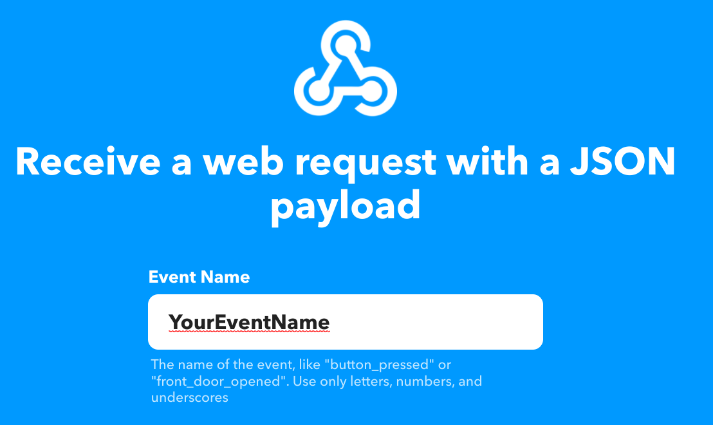
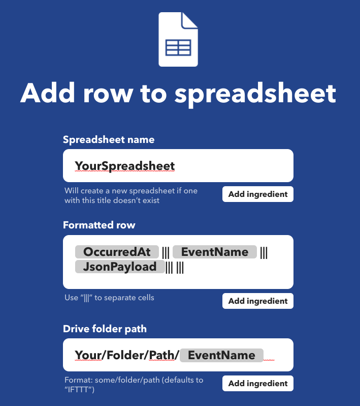
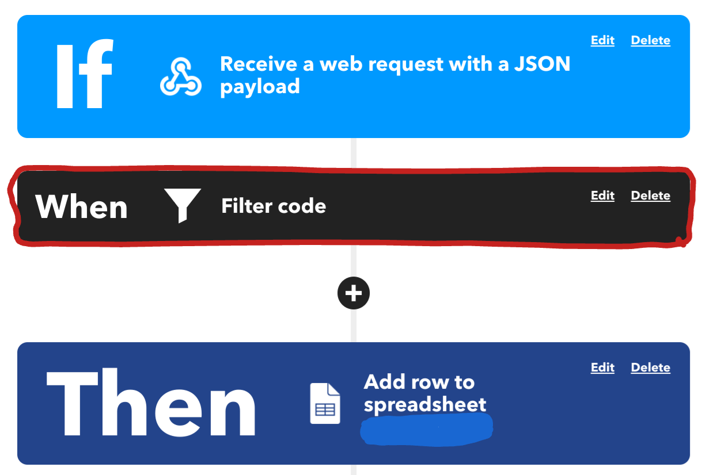

[](https://github.com/floroe1988/SpeedTest/actions/workflows/main.yml)

# SpeedTest
Python functionality to automate cyclical network speedtests and sync result to google
spread sheet

## Setup Edge Device
Clone repository to your local device
```
git clone https://github.com/floroe1988/SpeedTest.git
```

Setup a virtual environment where the applcation can live in and source it
```
python3 -m venv ~/.SpeedTest
source ~/.SpeedTest/bin/activate
```

cd into the cloned directory and run the following commant
```
make install
```

## Setup IFTTT
To store the results of the speedtest a corresponding webhook template has to be created 
inside IFTTT
To do so, first create a new template with a "webhook" containing a json payload as trigger


As resulting action configure "write to google sheet" (the entries for the formatting do not
matter, as these will be overwritten by the filter code which will be applied later)


Apply the following filter code to the IFTTT template

```
let payload = JSON.parse(MakerWebhooks.jsonEvent.JsonPayload)
let formattedRow = `${payload.date}|||${payload.time}|||${payload.download}|||${payload.upload}`
GoogleSheets.appendToGoogleSpreadsheet.setFormattedRow(formattedRow)
```

## Running the application
To start the applikation on the edge device, run the following command
```
python main.py
```

Once the application is running it will perform a speedtest every 10 minutes and store the result
inside the google spreadsheet which is defined in the IFTTT template. The result contains the 
current date and time as well as the download and uplaod speed.
